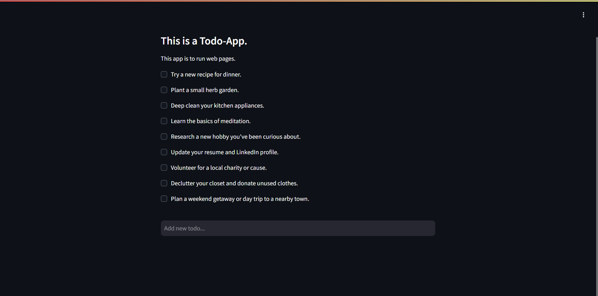

# 📝 Todo-Web-App

A simple web-based Todo application built with Python and Streamlit. ✅


## ✨ Features

- ➕ Add new todo items
- ✔️ Mark items as complete (which removes them from the list)
- 💾 Persistent storage of todos in a text file
- 🎨 Clean and intuitive interface

## 🛠️ Technologies Used

- 🐍 Python
- 🌐 Streamlit (for web interface)
- 📄 Plain text file for data storage

## ⚙️ Installation

1. Make sure you have Python installed (version 3.6 or higher recommended)
2. Install the required packages:
```bash
   pip install streamlit
```
## 🚀 Usage
Run the application:
```bash
  streamlit run web.py
```
## To add a new todo:

- ✏️ Type your task in the text box at the bottom
- ⏎ Press Enter to add it to your list

## To complete a todo:

- ☑️ Check the checkbox next to the item
- 🗑️ The item will automatically be removed from your list
 
## 📂 File Structure
- web.py - Main application file containing the Streamlit interface
- functions.py - Helper functions for reading/writing todos
- todos.txt - Text file where todos are stored (created automatically)

## 🔧 How It Works
- Todos are stored in a simple text file (todos.txt) 📄
- The app reads from this file when starting 🔄
- When you add or complete todos, the file is updated ✏️
- The interface automatically refreshes when changes are made ♻️

## 📋 Requirements
- Python 3.x 🐍
- Streamlit package 🌐

## 🔮 Future Improvements
- 📅 Add due dates to todos
- ⚠️ Add priority levels
- 🗂️ Categorize todos
- ✏️ Add ability to edit existing todos
